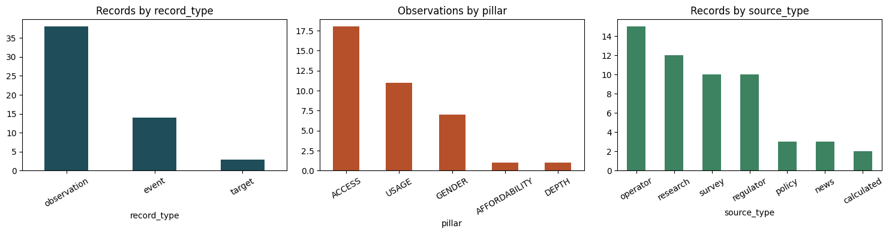
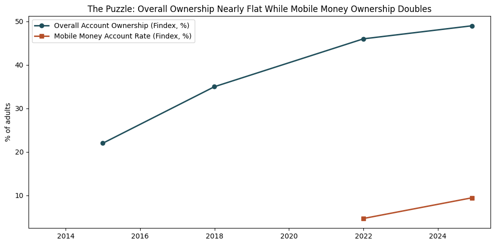
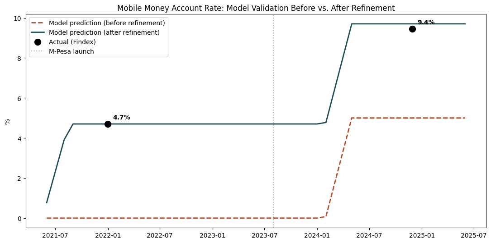
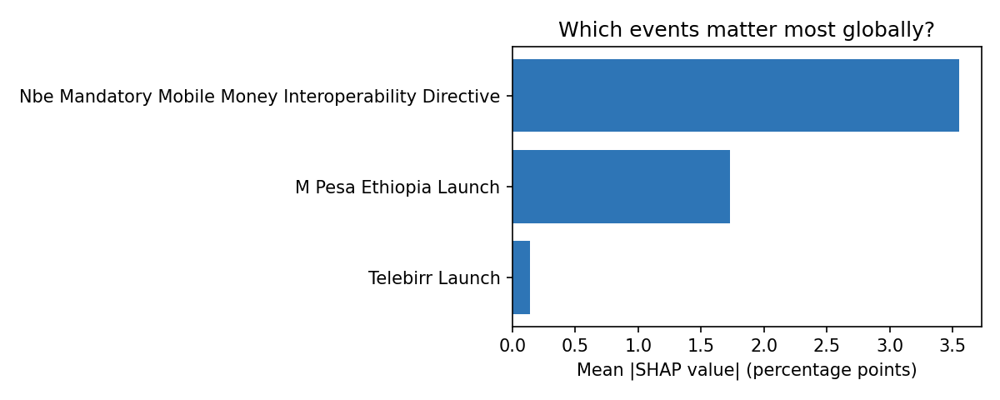
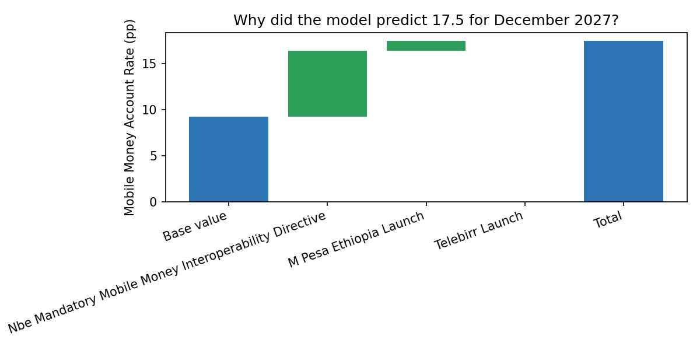

# Forecasting Financial Inclusion in Ethiopia: What I Learned Chasing Down Every Number

*A technical retrospective on building (and then rebuilding) a forecasting pipeline for Ethiopia's account ownership and mobile money adoption -- and why the honest answer was usually more interesting than the convenient one.*

## The setup

Ethiopia set itself an ambitious goal: 70% of adults with a financial account by 2025, up from around 46% in 2021. Two mobile money giants launched in that window -- Telebirr in 2021, M-Pesa in 2023 -- plus a national digital ID rollout and a regulatory push for interoperability between providers. On paper, that's exactly the kind of story a forecasting model should be able to tell well: real, dated events with plausible effects, layered on top of a slow-moving survey metric.

The project started simply: take a starter dataset of observations, events, and modeled "impact links" between them, enrich it, and forecast forward. It did not stay simple, and that turned out to be the interesting part.

## Lesson 1: the data will surprise you if you actually look at it

Early on, while just trying to explore the enriched dataset, the code crashed with a plain `TypeError`. Tracing it back: one real observation record -- account ownership for 2024, a genuinely important data point -- had its columns shifted by one, with free text sitting in what should have been a date field. Somewhere upstream, a row got misaligned.

The fix wasn't just a `try/except`. It was deciding what the *right* behavior even was: should one bad date cell in one record crash the entire dataset load? No -- the loader was rewritten to degrade a single bad cell to "missing" and keep going, with a test added specifically so this couldn't silently reappear and go unnoticed. Small bug, but it set the tone: read the data, don't just trust it.

## Lesson 2: a good forecast can hide a bad assumption

The most striking finding from the early exploratory analysis was a real puzzle: between 2021 and 2024, account ownership grew only 3 percentage points -- despite more than 65 million mobile money accounts being opened in that same window.

That gap became the whole motivation for the event-impact modeling work. And it exposed something uncomfortable almost immediately: the impact-links table -- the part of the dataset meant to encode "this event affects this indicator by this much" -- had *no link at all* connecting the Telebirr launch to the mobile money account indicator. The obvious primary driver of the metric wasn't wired into the model.

Once a properly calibrated link was added and validated against a real, held-out data point (not just fit to it), the model finally reflected reality. The lesson: a model can look reasonable and still be missing its single most important input. The only way to catch that was validating against real checkpoints, not just checking that the code ran.

## Lesson 3: "we couldn't verify this" doesn't mean "give up"

Later, revisiting the project with fresh eyes, one figure kept nagging: the 2024 Digital Payment Usage estimate wasn't read from Findex directly -- it was *algebraically derived* from a blog post that only reported a growth rate and a percentage-point change, not the actual number.

The first attempt to get the real figure failed cleanly and honestly: the primary Findex 2025 country table was blocked by a gated microdata download, an unparsable spreadsheet, and a JavaScript-rendered dashboard, in that order. Each was a real, documented dead end -- not evidence the number didn't exist.

Then a different route to the *same* primary source worked: a CSV export of the World Bank's own country dashboard, obtained a different way, contained the exact figure directly. **20.66%**, not the estimated 21.0% -- close, but a real, citable correction. The lesson: a "could not verify" finding is a checkpoint, not a dead end. Coming back to it with a different access route turned a medium-confidence guess into a high-confidence citation.

## Lesson 4: additive isn't always honest

Telebirr and M-Pesa are both mobile money products. The model, as originally built, combined their effects on the account-ownership indicator by simple addition -- which quietly assumes every person Telebirr reaches is a *different* person from everyone M-Pesa reaches. That's not really true; they're competing for the same underlying pool of potential adopters.

The fix was a "shared-ceiling" interaction term -- treating each product's effect as a probability of adoption and combining them the way you'd combine "reached by A" and "reached by B" into "reached by A or B," which naturally saturates instead of stacking without limit. It's a small change in the code, but the result mattered: error against a real, held-out 2024 checkpoint dropped from 0.25 percentage points to about 0.015 -- roughly a 16-fold improvement, measured, not assumed. It would have been very easy to skip this, since the additive version already looked "good enough." It wasn't.

## Lesson 5: explainability shouldn't be theater

The last stretch of this project asked for SHAP explanations -- a technique built for black-box machine learning models with dozens of opaque features. This project's actual forecasting logic is the opposite of that: a transparent, hand-built formula you can read in about thirty lines of code.

Rather than force SHAP onto something that didn't need it (or skip the requirement), the honest move was building a small **surrogate model** -- a gradient-boosted regressor trained to reproduce the real model's own predictions from named, meaningful features, one per contributing event. SHAP explains *that*. It's a real, standard technique (surrogate modeling for explainability), applied honestly rather than dressed up as something more exotic.

Building it surfaced two bugs before they shipped, which felt like the most validating part of the whole exercise. First version of the feature matrix accidentally recomputed effects with plain addition -- meaning it would have explained the *old*, already-superseded additive model instead of the current one with the interaction term from Lesson 4. Second version included a "time since baseline" feature that felt intuitive but wasn't actually part of the real formula at all -- it was just collinear with (and distorting attribution away from) the real causal features. Both were caught by checking the math, not by assuming the first version that ran without an error was correct.

## What actually changed, end to end

- **A missing link** in the impact model was found and calibrated against real data, not guessed.
- **A derived estimate** was replaced with a direct primary-source citation, a real (if modest) correction.
- **An independence assumption** that looked fine on paper produced a measurably worse forecast than the alternative -- fixed, and the improvement was verified, not assumed.
- **An explainability requirement** that could have been theater instead became a real, working surrogate model -- and building it honestly caught two bugs that would have shipped a misleading explanation.

## The uncomfortable headline, reported anyway

None of this changes the core finding: Ethiopia's account ownership rate is very unlikely to hit the NFIS-II's 70%-by-2025 target under anything but the most optimistic assumptions. Digital Payment Usage is forecast to stay essentially flat through 2027. That's not a satisfying conclusion to end a project on, but reporting it plainly -- the same way every other result in this project was reported, favorable or not -- was the actual standard the whole thing was built to.

## If I had more time

The Quality pillar of this dataset still has zero observations -- no citable, Ethiopia-specific source for mobile money transaction success rates or complaint statistics turned up in the time available. The refresh mechanism built for this project can rebuild and validate on demand, but there's no live data feed yet for it to actually monitor on a schedule. And the interaction term validated well against two data points; a third competing product entering the market would be a genuinely stronger test of it. All three are documented, specifically, as open items -- not vague gestures at "future work."

---

*Full code, data-quality notes, and test suite: [github.com/yenguandroid/Improved-Forecasting-Financial-Inclusion-in-Ethiopia](https://github.com/yenguandroid/Improved-Forecasting-Financial-Inclusion-in-Ethiopia)*
